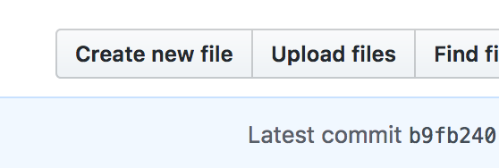

# Modifier une photo

Il faut aller dans le dossier contenant les images sources https://github.com/ftmftrs/ftmftrs.github.io/tree/master/src/img

Dans le dossier :
- 0.5: c'est toutes les images pour les portraits ou paysage mais qui ne sont pas en plein écran
- 1: c'est les images en plein écras actuellement c'est seulement la page d'accueil

Si vous voulez changer la photo de la page présentation, c'est l'image `fatumfatras-instruments.jpg`
- [Visualisable ici](https://github.com/ftmftrs/ftmftrs.github.io/blob/master/src/img/0.5/fatumfatras-instruments.jpg)
- Vous pouvez supprimer la photo avec l'icone poubelle à droite

- Puis vous pouvez ajouter de nouveau une photo depuis [l'adresse suivante](https://github.com/ftmftrs/ftmftrs.github.io/blob/master/src/img/0.5/) avec le bouton "Upload file"

